# QuickCart — Architecture Diagrams & Flowcharts

---

## 1. High-Level System Architecture

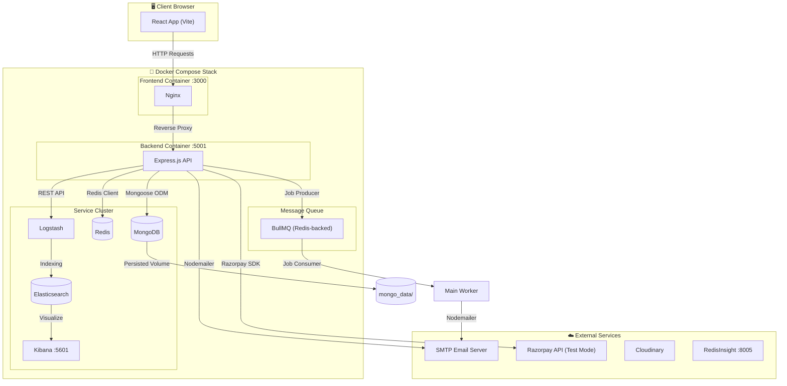

---

## 2. Backend Architecture (Express API)

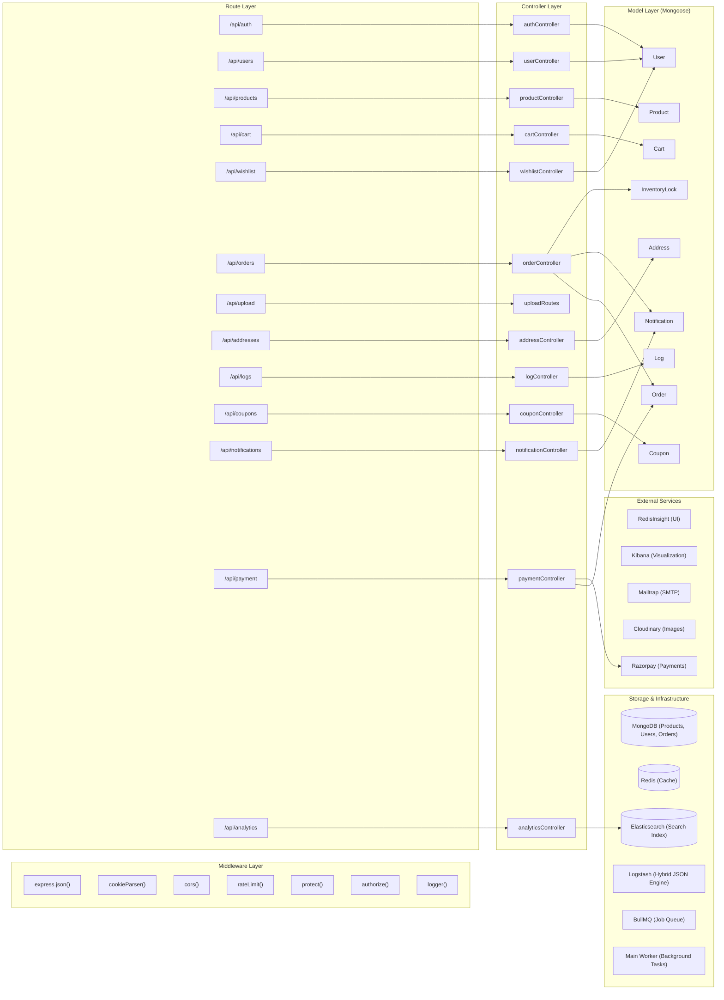

---

## 3. Database Schema (Entity Relationship Diagram)

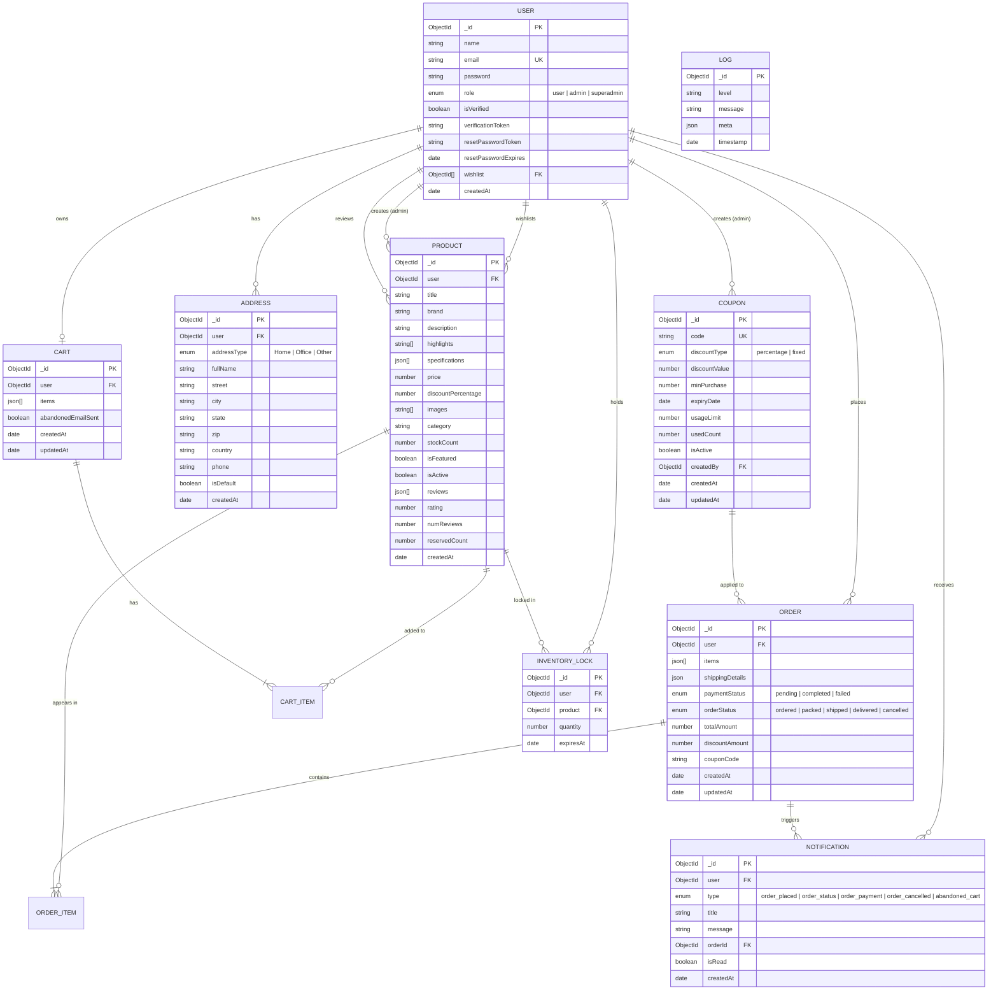

---

## 4. Frontend Architecture (React + Redux)

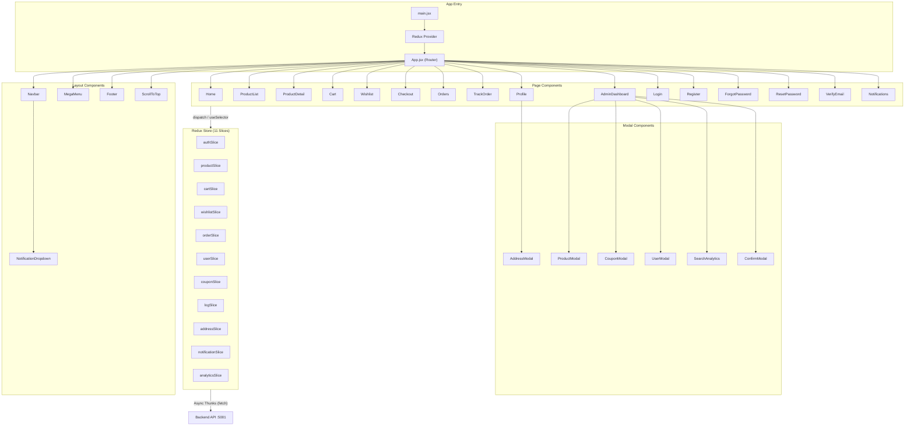

---

## 5. Authentication Flow

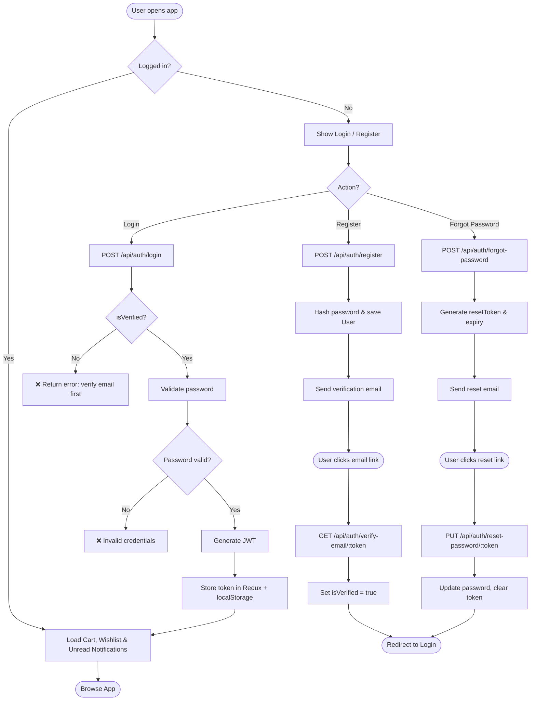

---

## 6. Order / Checkout Flow

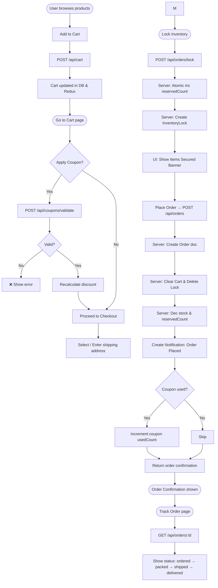

---

## 7. Admin Management Flow

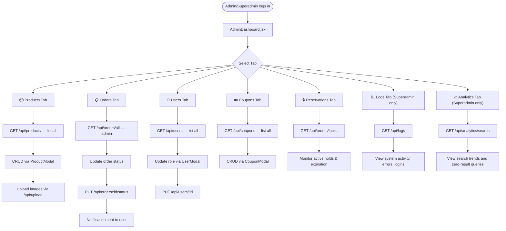

---

## 8. API Request Lifecycle

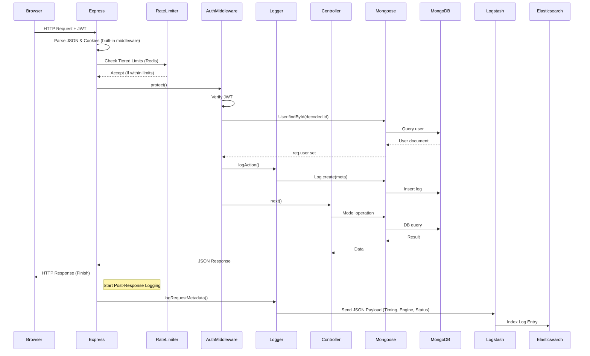

---

## 9. Deployment Architecture (Docker Compose)

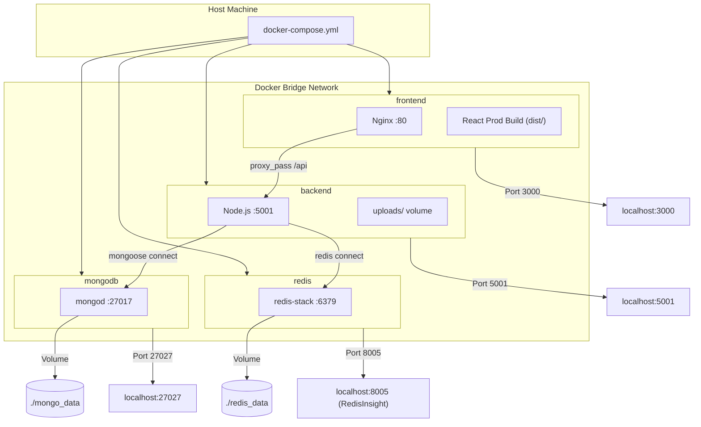

---

## 10. Frontend Route Map

| Route | Page Component | Auth Required | Role |
|---|---|---|---|
| `/` | `Home` | ❌ | Any |
| `/products` | `ProductList` | ❌ | Any |
| `/product/:id` | `ProductDetail` | ❌ | Any |
| `/cart` | `Cart` | ✅ | User |
| `/wishlist` | `Wishlist` | ✅ | User |
| `/checkout` | `Checkout` | ✅ | User |
| `/orders` | `Orders` | ✅ | User |
| `/order/:id/track` | `TrackOrder` | ✅ | User |
| `/profile` | `Profile` | ✅ | User |
| `/admin` | `AdminDashboard` | ✅ | Admin / Superadmin |
| `/login` | `Login` | ❌ | Any |
| `/register` | `Register` | ❌ | Any |
| `/forgot-password` | `ForgotPassword` | ❌ | Any |
| `/reset-password/:token` | `ResetPassword` | ❌ | Any |
| `/verify-email/:token` | `VerifyEmail` | ❌ | Any |
| `/notifications` | `Notifications` | ✅ | User |

---

## 11. Redux State Shape

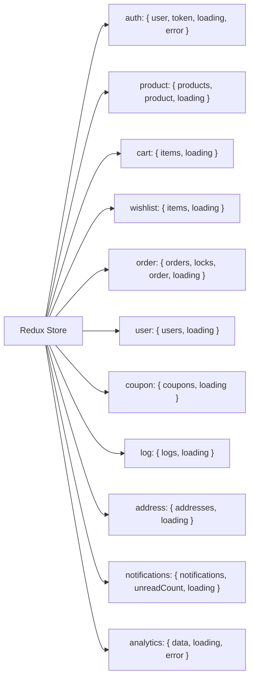

---

## 12. Abandoned Cart Tracking Flow (BullMQ)

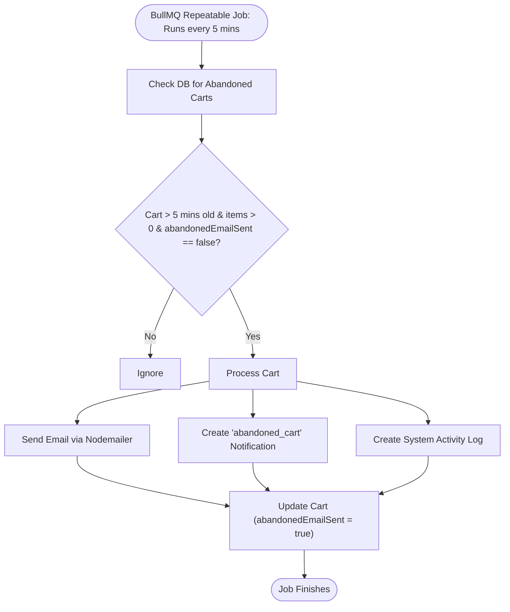

---

## 13. Razorpay Payment Workflow

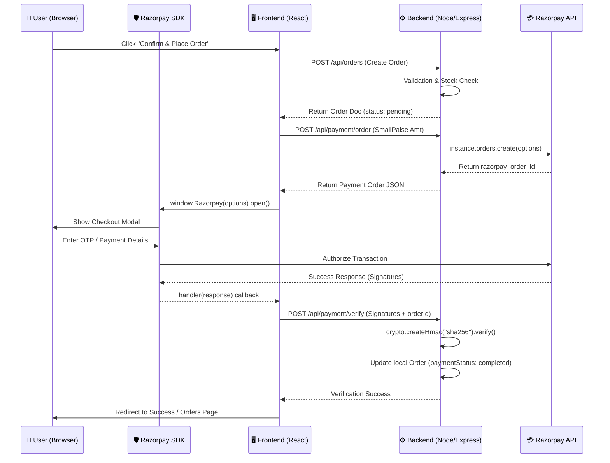
